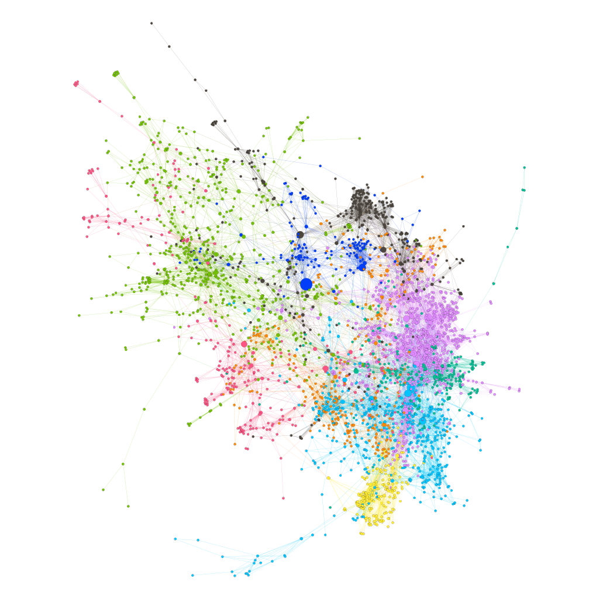

```{r setup, include=FALSE}
knitr::opts_chunk$set(echo = TRUE)
```

**Research question:** How do researchers organize themselves and distribute tasks internally?

## Screening

The following network includes all researchers identified using a author name disambiguation algorithm (Caron & van Eck, 2014) whose main organization is TU Delft and have published at least 5 publications in collaboration with other institutional partners between 2008 and 2017.


